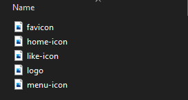

Yesterday, I started working on a pet project to build a light Instagram web clone.

Aside from being a fun project to build, it'll serve as a case study for the Instagram UI.

To "begin at the beginning", I decided to find out what assets (icons and logos) the amazing team at Facebook used, and in the process, I discovered something quite interesting.

It is common for websites to store individual assets as files,



When you visit such websites, your browser will make multiple network requests to fetch each asset. Users with slow internet will notice some icons load faster than others.

To tackle this problem, the team decided to store all their image assets in a single compressed file called spritesheet.

A sprite sheet is a series of images combined into a larger image.


This allows your browser to fetch your assets in a single network request, making all icons and logos available at the same time. Including assets of pages you haven't visited yet. Making your app perform better offline.

This will require the developer to know the location of each image bounding rectangle. This isn't a problem if you have access to the design file (e.g Figma) of the spritesheet.

You then extract assets using CSS properties like this:

```html
<style>
    .asset {
        background-image: url(/sprite.png)
    }

    .black-pad-lock-icon {
        background-position: -130px 0;
        background-repeat: no-repeat;
        height: 96px;
        width: 96px;
    }
</style>

<span class="asset black-pad-lock-icon"></span>
```

This is a great approach as long as you know the exact location and dimensions of each image.

Check out my Instagram clone where I used the spritesheet approach to create the icons.

[Live Link](https://frosty-jang-51ab28.netlify.app/)
